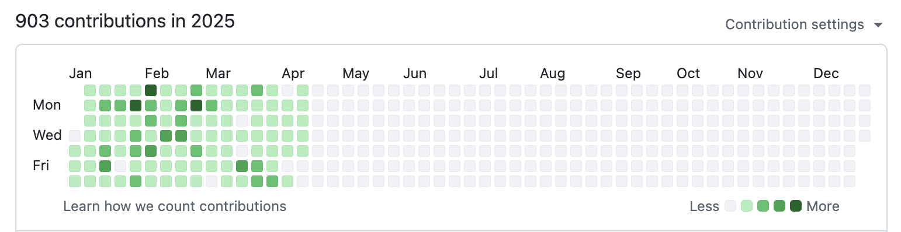
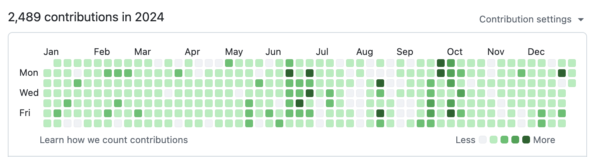

# Pedro Enrique – Engineering Resume Hub

👋 Hi, I'm Pedro — a Senior Software Engineer with over 14 years of experience building high-performance applications across mobile, backend, and full stack platforms.

I've worked with companies like Salesforce, Automox, Shopmonkey, and also founded Volandoo — a live tracking and event platform for the paragliding community. I'm passionate about crafting scalable systems, intuitive mobile apps, and reliable user experiences.

This repo contains my most up-to-date resumes and cover letters, tailored for different roles:

-   **Full Stack**: Golang, Node.js, React, Microservices
-   **Mobile**: Native iOS/Android, Swift, Kotlin, Obj-C  
    Each resume highlights relevant projects, experience, and achievements in that domain.

---

## 📄 Resumes

-   📱 [Mobile Engineer Resume](mobile-resume.md)
-   💻 [Full Stack Engineer Resume](full-stack-resume.md)

## ✉️ Cover Letters

-   📱 [Mobile Engineer Cover Letter](mobile-cover-letter.md)
-   💻 [Full Stack Engineer Cover Letter](full-stack-cover-letter.md)

---

### 🚀 Featured Project: [Volandoo](https://volandoo.com)

Volandoo is a real-time GPS live tracking platform I created for paragliding and hang gliding.  
Built with native mobile apps, a custom time-series backend, and a modern event management UI, it now serves over 8,000 pilots and organizers worldwide.

---

Pedro's GitHub stats up to April 17, 2025:  

---

Feel free to reach out via [LinkedIn](https://linkedin.com/in/pec1985) or email me at **pedro.tma@gmail.com**.
